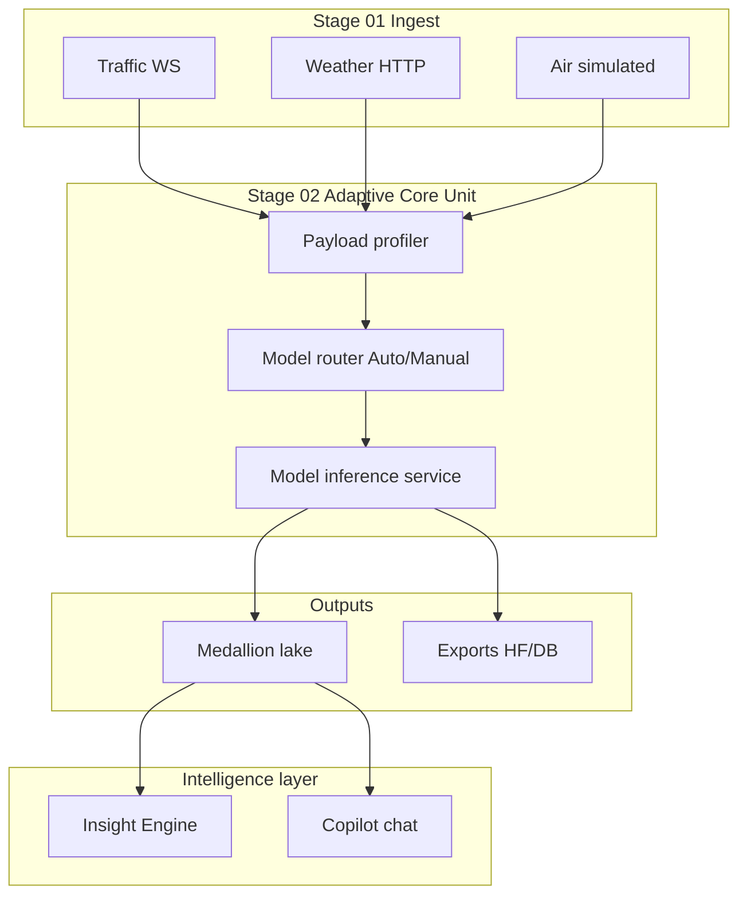

# Flowmatic Adaptive Platform Roadmap

**Document purpose:** Master handoff for thesis-aligned adaptive intelligence work. Captures current platform state, the scientific direction, phased delivery plan, and what the next agent should do first.

**Thesis title:** *Development of an Intelligent Assistant for Data Preparation Automation in Urban Transportation Management Systems* (Astana IT University, memoir v5).

**Last updated:** 2026-05-26 (post-cleanup: export-test profile, archived legacy docs, README refresh)

**Cleanup (2026-05-26):** Removed `archive-python/`, legacy compose backup, stale lockfiles, redundant thesis screenshots, superseded handoff checklist. Export-test Postgres/Mongo moved to Docker profile `export-test`. Planning docs archived under `docs/archive/`.

---

## 1. Executive summary

Flowmatic started as a classical tabular ML thesis (DQI, XGBoost, IF/LOF/OCSVM, Kafka sketches) and evolved into a **production smart-city data platform** with:

- Batch upload preparation (quality → clean → export)
- Live smart-city pipelines (ingest → core unit → medallion lake → export)
- A **neural research suite** (PatchTST, TranAD, STGCN, SAITS, etc.) on multiple datasets
- An **Insight Engine** (profiler → analysis → LLM/rules planner → adaptive charts)
- An interactive **pipeline copilot** (chat + slash charts)

**What was missing for “really adaptive”:** the core unit always used **one manually selected model** for every event — geospatial traffic could theoretically hit a weather forecaster.

**Phase 1 (implemented now):** **Auto vs Manual core unit mode**

| Mode | Behavior |
|------|----------|
| **Manual** | Operator picks one HF/research model; all events use it (previous behavior). |
| **Auto** | Platform builds a **modality-safe routing policy** from the trained model registry and routes each event to the best checkpoint. Rules apply per event; OpenAI optionally refines bindings when `OPENAI_API_KEY` is set. |

This is the first step toward a thesis-grade **adaptive intelligent assistant** that selects methods based on data, not only narrates results.

---

## 2. Current application state (for handoff)

### 2.1 Repository layout

| Area | Path | Role |
|------|------|------|
| Backend API | `backend/src/` | NestJS + Prisma + queues |
| Frontend SPA | `frontend/src/` | Vue 3 workbench + insights |
| Model training | `models/` | Checkpoints, leaderboard, HF manifest |
| Thesis docs | `thesis/` | GAP analysis, supplement, LaTeX, screenshots |
| Docker stack | `docker-compose.yml` | Postgres, MinIO, RabbitMQ, simulators, inference |
| Demo traffic CSV | `data/astana_synthetic_data.csv` | Astana semi-synthetic stream |

### 2.2 Runnable services (typical dev)

```bash
docker compose up -d          # full stack at http://localhost
# Optional export adapter test DBs:
# docker compose --profile export-test up -d postgres-export-test mongo-export-test
# Backend API: http://localhost:8080/api/v1
# Frontend:    http://localhost
```

Key containers: `flowmatic-backend`, `flowmatic-frontend`, `flowmatic-sensor-simulator`, `flowmatic-model-inference`, Postgres, MinIO.

### 2.3 User-facing features (shipped)

#### Authentication & orgs
- Multi-tenant organizations, invitations, settings, HF token storage

#### Batch pipeline (`/upload`)
- CSV/JSON upload → async quality/clean → LLM summary (optional) → export adapters

#### Smart City workbench (`/connectors`)
- **Stage 01 · Ingest:** sensor sources (simulated, HTTP, WebSocket including Astana traffic geo stream)
- **Stage 02 · Process / Core unit:** Manual or **Auto** adaptive routing (new)
- **Data lake:** bronze / cleaned / business tiers on S3-compatible storage
- **Export targets:** Postgres, MongoDB, Hugging Face, files (continuous or on-demand)
- **Federated demo:** optional coordination endpoint
- Live SSE stream, backfill, observability log

#### Pipeline Insights (`/insights`)
- **Insight Engine:** scheduled/on-demand analysis with adaptive viz (maps on real OSM lat/lng, heatmaps, scatter, timeline)
- **Copilot chat:** NL Q&A, slash charts, chips, jump-to-chat widget
- Progressive disclosure UX (compact config, accordions, chart modals)

### 2.4 Model assets

| Source | Location | Notes |
|--------|----------|-------|
| Local checkpoints | `models/checkpoints/*/metadata.json` | Used by `model-inference` via `research:<run>` |
| HF manifest | `models/reports/huggingface_model_manifest.json` | 13+ uploaded models with `kind`, `dataset` |
| Leaderboard | `models/paper/tables/checkpoint_leaderboard.md` | Q1 experiment tracking |
| Artifacts (tabular) | `models/artifacts/` | Legacy JSON models (not wired to live inference) |

**Modalities in registry today:** traffic (Astana), weather (HF weather), energy (ETT), graph traffic (STGCN).

### 2.5 Intelligence layers (honest map)

| Layer | Status | Thesis alignment |
|-------|--------|------------------|
| Rule/statistical QC (batch) | ✅ Shipped | Partial vs six-dimension DQI |
| LLM quality narrative (batch) | ✅ Optional | Assistant narrative, not SHAP |
| Live cleaning (stream) | ✅ Basic null-strip/normalize | Not full thesis FE table |
| **Core unit inference** | ✅ Manual + **Auto routing** | Adaptive model selection (new) |
| Insight Engine | ✅ Shipped | Operator assistant / monitoring |
| Copilot chat | ✅ Shipped | Interactive assistant |
| Classical XGBoost/ensemble in Nest | ❌ Not production path | Still in thesis text |
| Multi-dataset Q1 evaluation in paper | 🟡 In progress | Needs Phase 2–3 |

### 2.6 Key backend modules (Smart City)

```
smart-city.service.ts          # ingest, processing, export orchestration
pipeline-model-registry.service.ts   # loads manifest + checkpoints
pipeline-model-router.service.ts     # modality/task routing rules
pipeline-auto-routing.service.ts       # LLM policy refinement (optional)
pipeline-insight*.ts           # scheduled insight engine
pipeline-copilot.service.ts    # chat + context
```

### 2.7 Core unit Auto mode — how it works

1. Operator configures **Stage 01** sources (traffic / weather / air / WebSocket).
2. Opens **Core unit → Auto** and saves.
3. Backend `POST .../core-unit/auto-policy`:
   - Reads sensor kinds on the pipeline
   - Builds rule bindings from `PipelineModelRouterService`
   - Optionally refines via OpenAI (`PipelineAutoRoutingService`)
   - Prefetches local checkpoints
   - Stores policy in `streamConfig.autoRoutingPolicy`
4. On each live event (`runProcessingForEvent`):
   - Classifies payload (modality, geo, task)
   - Resolves `research:<run>` or `hf:<repo>` from policy/rules
   - Runs inference; writes `lastAutoResolution` in streamConfig
   - **Never routes weather models to traffic modality** (hard modality filter)

**API endpoints (new):**

- `GET  /smart-city/pipelines/:id/core-unit/routing-preview`
- `POST /smart-city/pipelines/:id/core-unit/auto-policy`

**streamConfig fields (new):**

```json
{
  "coreUnitMode": "manual | auto",
  "autoRoutingPolicy": { "generatedAt", "plannerSource", "summary", "bindings[]" },
  "lastAutoResolution": { "modelId", "label", "reason", "sensorKind", "at" }
}
```

### 2.8 Known gaps / caveats

- Auto mode uses **registry metadata**, not live latency-aware load balancing.
- `anomalyDetection` / `schemaValidation` flags are not fully distinct code paths yet.
- Artifact DB deploy (`activeModelId` = cuid) still does not infer — use `research:` or `hf:`.
- Astana-only demo is **not sufficient for Q1 thesis** — multi-source validation required (Phase 2–3).
- Thesis Chapter 4–5 text still describes classical stack; needs rewrite to match experiments.

### 2.9 Remaining engineering work (post–Phase 1)

- Export/federated delivery reliability (retries, DLQ, idempotency)
- Deeper observability (trends, not only snapshot cards)
- Alert persistence and acknowledge flow
- Data lake compaction, retention, catalog metadata
- Export target edit/delete UX polish
- Integration test coverage for smart-city flows

### 2.10 Agent onboarding checklist

1. Read this document (`ADAPTIVE_PLATFORM_ROADMAP.md`)
2. Inspect `backend/src/modules/smart-city/` and `frontend/src/pages/connectors-page.vue`
3. Run `cd backend && bun run typecheck && bun run build`
4. Run `cd frontend && bun run type-check`
5. Confirm Prisma migrations applied (`bun run prisma:migrate` on fresh DB)
6. Use Bun — do not reintroduce mock paths that are already real

---

## 3. Scientific direction (thesis rewrite)

### 3.1 Keep from literature review
- Urban ITS data preparation burden
- Quality dimensions, anomaly detection, forecasting, classification literature
- Smart-city streaming / medallion / MLOps context

### 3.2 Rewrite methodology & experiments to match Flowmatic

**New central claim:**

> An intelligent assistant for urban transportation data preparation must **(1)** automate quality-aware ingestion and export, **(2)** **adapt model choice to sensor modality and task**, and **(3)** present evidence-backed insights to operators — validated across **multiple public datasets**, not a single city CSV.

**Replace / extend old thesis experiments:**

| Old thesis emphasis | New platform evidence |
|--------------------|------------------------|
| Single-table XGBoost classifier | Multi-model registry + auto router + neural suite |
| IF/LOF/OCSVM ensemble | TranAD + autoencoder + statistical QC |
| Fixed 16 traffic features | Profiler-driven FE suggestions + checkpoint-specific inputs |
| Kafka diagram | Docker compose diagram (`thesis/figures/architecture/*.mmd`) |
| Astana semi-synthetic only | Astana + HF weather + ETT + traffic graph datasets |

### 3.3 Q1-worth evaluation bar

Minimum for defensible master’s / journal submission:

1. **≥3 external dataset families** (not just Astana)
2. **Per-task metrics** with confidence intervals or multi-seed runs
3. **Ablation table:** auto routing vs manual wrong-model vs best single model
4. **Latency / cost** for live pipeline (events/sec, inference ms)
5. **Failure analysis:** when auto routing picks wrong model (confusion matrix by modality)
6. Reproducible scripts under `models/paper/` and `thesis/experiments/`

---

## 4. Phased delivery plan

### Phase 1 — Auto core unit (✅ implemented, needs verification)

**Goal:** Adaptive routing in production path.

**Deliverables:**
- [x] Model registry service (manifest + checkpoints)
- [x] Rule-based router (modality + task + geo)
- [x] Optional LLM policy refinement
- [x] Workbench UI: Manual / Auto toggle
- [x] Live per-event routing + `lastAutoResolution`
- [x] Unit tests (`pipeline-model-router.spec.ts`)

**Verification checklist (human QA):**
- [ ] Create pipeline with **traffic** WebSocket (Astana) + **weather** simulated source
- [ ] Enable **Auto**, start pipeline, confirm different models in processing SSE / logs
- [ ] Confirm weather events never show traffic checkpoint IDs in `routing.modelId`
- [ ] Run `POST .../test-processing` in auto mode
- [ ] Capture screenshots for thesis (`thesis/figures/screenshots/`)

**If verification fails:** check `models/checkpoints` mounted in backend container, `MODEL_INFERENCE_URL`, manifest path.

---

### Phase 2 — Decide model portfolio & collect data

**Goal:** Curate which models the adaptive platform officially supports (not every experimental checkpoint).

**Tasks:**
1. Audit `checkpoint_leaderboard.md` + manifest — pick **best per modality/task**:
   - Traffic forecast (PatchTST / iTransformer / TCN)
   - Traffic anomaly (TranAD / autoencoder)
   - Weather forecast (TimesBlock / transformer)
   - Graph traffic (STGCN)
   - Imputation (SAITS)
   - Severity classification (transformer classifier)
2. Add **capability matrix** to registry (input schema, horizon, required fields) — extend `metadata.json` schema.
3. Download/prepare **non-Astana** benchmarks:
   - METR-LA / PeMS-BAY / PeMSD4 (traffic graph + series)
   - HF weather bundle (already partially used)
   - ETT (energy multivariate — proxy for utility telemetry)
4. Wire ingestion scripts under `models/paper/` or `thesis/experiments/`.
5. Update auto router priorities from leaderboard winners only.

**Exit criteria:** Registry contains ≤8 production models with documented input contracts; 3+ dataset families ingested.

---

### Phase 3 — Train, validate, ablate (Q1 experiments)

**Goal:** Numbers for paper/thesis.

**Tasks:**
1. Retrain or fine-tune winners on each dataset with **fixed seeds** (42, 7, 2026).
2. Produce tables:
   - Forecast: MAE, RMSE, MAPE, CRPS (where applicable)
   - Anomaly: F1, AUROC, event-level delay
   - Classification: macro-F1, calibration
3. **Ablation studies:**
   - Auto router vs oracle model vs worst manual mismatch
   - Insight planner LLM vs rules-only
   - With/without geospatial features
4. **Cross-dataset generalization:** train Astana → test PeMS slice (limited transfer experiment).
5. Export LaTeX tables to `thesis/latex/tables.tex`.
6. Upload new checkpoints + refresh manifest.

**Exit criteria:** All tables reproducible from one command; results cited in rewritten Chapter 5.

---

### Phase 4 — Paper & thesis rewrite

**Goal:** Q1-ready manuscript aligned with implemented system.

**Tasks:**
1. Rewrite **Methodology** to describe:
   - Platform architecture (Figures from `thesis/figures/architecture/`)
   - Adaptive core unit + insight engine
   - Model registry and routing algorithm (pseudo-code)
2. Replace old Kafka-only deployment figure with compose topology.
3. Add **Case study:** Astana live demo + multi-dataset offline evaluation.
4. Related work: position neural suite vs classical thesis baselines (don't discard — compare).
5. Antiplagiarism + AI-detection pass on final Russian/English text.
6. Screenshots: workbench auto mode, insights maps, export health.

**Suggested thesis chapter mapping:**

| Chapter | Content |
|---------|---------|
| 1 Introduction | Problem + adaptive assistant thesis statement (updated) |
| 2 Literature | Keep core, add MLOps/smart-city streaming refs |
| 3 Methodology | Flowmatic architecture + routing + insight engine |
| 4 Implementation | Nest/Vue/inference services, docker |
| 5 Experiments | Multi-dataset Q1 tables + ablations |
| 6 Conclusion | Limitations (LLM optional, no SHAP yet) + future work |

---

## 5. Adaptive platform vision (target end state)



**Future enhancements (post Phase 4):**
- Per-model input schema validation before inference
- Online router feedback (track error rates, demote bad bindings)
- DQI composite score surfaced in UI
- SHAP or feature-attribution for classifier checkpoints
- Federated round ties to auto-selected local models

---

## 6. File index for next agent

| Task | Start here |
|------|------------|
| Fix auto routing bug | `pipeline-model-router.service.ts`, `smart-city.service.ts` |
| Add model to registry | `models/reports/huggingface_model_manifest.json`, checkpoint `metadata.json` |
| Change UI copy | `pipeline-modals.vue`, `pipeline-processing-stage.vue` |
| Insight/copilot context | `pipeline-copilot.service.ts` |
| Thesis gap analysis | `thesis/GAP_ANALYSIS.md`, `thesis/THESIS_SUPPLEMENT_V2.md` |
| Run upload experiment | `thesis/experiments/` |
| Docker issues | `docker-compose.yml`, `backend/Dockerfile` |

---

## 7. Immediate next steps (priority order)

1. **Verify Phase 1** auto routing on a live pipeline (traffic + weather sources).
2. **Screenshot** auto mode bindings + processing log for thesis.
3. **Phase 2 kickoff:** prune registry to leaderboard winners; document capability matrix.
4. **Download** METR-LA / PeMS samples; add ingestion notebooks.
5. **Schedule** Phase 3 training runs with fixed seeds.
6. **Begin** methodology chapter rewrite using this document as outline.

---

## 8. Related documents

- `README.md` — quick start (Docker + local dev)
- `thesis/GAP_ANALYSIS.md` — manuscript vs code matrix
- `thesis/THESIS_SUPPLEMENT_V2.md` — Q1 supplement narrative
- `backend/docs/PROJECT_GUIDE.md` — batch pipeline guide
- `docs/archive/` — superseded planning docs (smart-city plan, UI brief, refactor audit)

---

*Maintainers: update §2 “Last updated” and Phase checkboxes when completing verification or experiments.*
