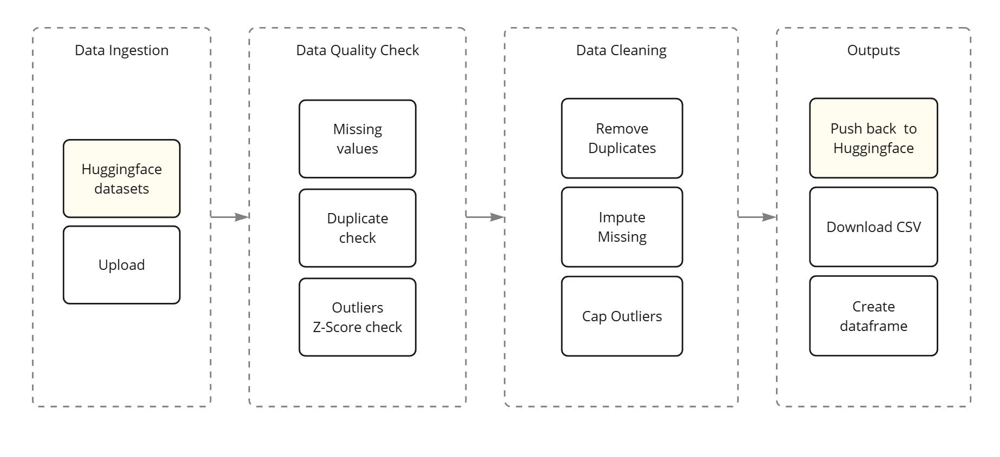

# Flowmatic

**Flowmatic** is an end-to-end, modular pipeline for time-series data preprocessing in smart-city environments. It provides tools to ingest raw sensor streams (CSV/JSON or Hugging Face datasets), automatically detect data-quality issues (missing values, duplicates, outliers), clean or impute those anomalies, and serve the results via a minimal FastAPI web interface. Optional integration with the OpenAI API enables automated explanations of detected anomalies.

---

## Flowmatic Pipeline Overview

Here’s a high-level diagram of the Flowmatic preprocessing workflow:



---

## Features

* **Data Ingestion**
  – Load local CSV/JSON files or pull from public/private Hugging Face datasets
* **Data Quality Checking**
  – Report missing values, count duplicates, and detect statistical outliers via Z-score
* **Data Cleaning**
  – Remove duplicates, interpolate or forward-fill missing values, winsorize outliers
* **FastAPI Web Interface**
  – Upload or load data, view quality reports, preview cleaned data, download CSV/JSON
* **Export Options**
  – Push cleaned data to a Hugging Face Hub dataset or upload to PostgreSQL
* **OpenAI Anomaly Explanations (Optional)**
  – Ask the model to interpret potential real-world causes of outliers (if API key is configured)

---

## Project Structure

```flowmatic/
├── README.md
├── requirements.txt
├── docs/
│   ├── images/
│   │   └── flowmatic-pipeline.jpg    # Pipeline visualization
│   └── sample_traffic_data.csv       # Example dataset
├── static/
│   └── icons/
│       ├── upload.svg
│       ├── huggingface.svg
│       ├── postgres.svg
│       └── psql.svg
├── templates/
│   └── index.html                    # Jinja2 template for FastAPI
├── flowmatic/
│   ├── __init__.py
│   ├── streamlit-demo/
│   │   └── app.py                    # (Optional) Streamlit demo entrypoint
│   ├── ingestion.py                  # Loading CSV/JSON or HF datasets
│   ├── quality_check.py              # Reporting missing values, duplicates, outliers
│   ├── cleaning.py                   # Imputation, duplicate removal, outlier capping
│   ├── hf_push.py                    # Helpers to push DataFrame to HF Hub
│   ├── db_upload.py                  # Helpers to upload DataFrame to PostgreSQL
│   └── server.py                     # FastAPI server exposing Flowmatic functionality
├── .env.example                      # Example environment variables
└── .gitignore
```

---

## Installation

1. **Clone the repository**

   ```bash
   git clone https://github.com/your-org/flowmatic.git
   cd flowmatic
   ```

2. **Create a virtual environment & install dependencies**

   ```bash
   python3 -m venv .venv
   source .venv/bin/activate      # macOS/Linux
   .venv\Scripts\activate         # Windows
   pip install --upgrade pip
   pip install -r requirements.txt
   ```

---

## Configuration

### Environment Variables

Create a copy of `.env.example` and fill in any values you need. For example:

```bash
cp .env.example .env
```

Open `.env` in your editor and set:

```
HF_TOKEN=your_huggingface_token
OPENAI_API_KEY=your_openai_key
```

* `HF_TOKEN` (optional)
  Required if you plan to ingest private Hugging Face datasets or push to a private dataset repo.

* `OPENAI_API_KEY` (optional)
  Required if you want to enable automatic anomaly explanations via the OpenAI API.

---

## Usage

### 1. FastAPI Web Server

This is the primary interface for Flowmatic. It lets you upload or load data, view quality metrics, preview the cleaned results, and export to either Hugging Face or PostgreSQL—all from the browser.

1. **Run the FastAPI server**

   ```bash
   uvicorn flowmatic.server:app --reload
   ```

2. **Open your browser** at `http://127.0.0.1:8000/`.

3. **Workflow**:

   * **Upload or Hugging Face**
     Choose “Upload File” or “Hugging Face” via the radio buttons. If you select “Upload File,” pick a local CSV/JSON; if you select “Hugging Face,” enter the dataset ID, split, and optionally your HF token.

   * **Data Quality Insights**
     After processing, Flowmatic displays:

     * Number of duplicate rows
     * Number of outliers (|Z-score| > 3)
     * A table of missing-value counts per column

   * **Cleaned Data Preview**
     View the first 50 rows of the cleaned DataFrame in a table.

   * **Download Cleaned Data**
     Download as CSV or JSON.

   * **Export Options**
     Select either “Push to Hugging Face” (enter your HF token & repo name) or “Upload to PostgreSQL” (enter or accept defaults for host, port, db, user, password, table). Only the relevant input fields appear based on your selection.

   * **Toast Notifications**
     Success or failure of an HF push or DB upload shows a small “toast” message in the top right, which automatically hides after 5 seconds.

---

### 2. (Optional) Streamlit Demo

If you prefer an interactive Streamlit app instead, there is a minimal demo in `flowmatic/app.py` (and `flowmatic/streamlit_demo/` if present). This provides similar ingestion → quality check → cleaning → export workflows inside a Streamlit interface.

To run the Streamlit demo:

```bash
streamlit run flowmatic/streamlit-demo/app.py
```

> **Note:** The Streamlit demo is optional. The FastAPI server is the recommended production interface.

---

## Module Overview

### flowmatic/ingestion.py

* **`ingest(source: str, split: str=None, token: str=None) → pd.DataFrame`**
  Loads local CSV/JSON or Hugging Face datasets, automatically detects a datetime‐like column to set as the index, and returns a `DataFrame` with a `DatetimeIndex`.

### flowmatic/quality\_check.py

* **`report_missing(df: pd.DataFrame) → pd.Series`**
  Returns the count of missing values per column.
* **`report_duplicates(df: pd.DataFrame) → int`**
  Returns the number of duplicate rows.
* **`detect_outliers_zscore(df: pd.DataFrame, threshold: float=3.0) → pd.DataFrame`**
  Returns a sub-DataFrame of rows whose numeric columns exceed the Z-score threshold.
* **`quality_report(df: pd.DataFrame) → dict`**
  Prints a summary to console and returns a dictionary containing:

  ```
  {
    "missing": pd.Series,       # missing count per column
    "duplicates": int,          # total duplicate rows
    "outliers": pd.DataFrame,   # rows flagged as outliers
  }
  ```

### flowmatic/cleaning.py

* **`clean(df: pd.DataFrame) → pd.DataFrame`**
  Runs a three-stage cleaning pipeline:

  1. **Remove duplicates**
  2. **Impute missing values** (time-based interpolation or forward/backward fill)
  3. **Cap outliers** using winsorization (clipping to specified quantiles)
     Returns a cleaned `DataFrame`.

### flowmatic/hf\_push.py

* **`ensure_hf_repo(repo_name: str, token: str, private: bool=False) → str`**
  Checks if a Hugging Face Hub *dataset* repo exists for your username. If not, creates it. Returns the full repo ID (e.g. `username/repo_name`).
* **`push_df_to_hf(df: pd.DataFrame, repo_name: str, token: str, path_in_repo: str="cleaned.csv", commit_message: str="Add cleaned data", branch: str="main") → None`**
  Exports `df` to a temporary CSV and `upload_file(...)` to the HF Hub dataset under `path_in_repo`.

### flowmatic/db\_upload.py

* **`build_postgres_url(username: str, password: str, host: str, port: int, database: str) → str`**
  Constructs a SQLAlchemy database URL for PostgreSQL (e.g. `postgresql+psycopg2://user:pw@host:port/db`).
* **`infer_sqlalchemy_types(df: pd.DataFrame) → dict`**
  Infers an appropriate SQLAlchemy dtype (Integer, Float, DateTime, Boolean, Text) for each column.
* **`upload_df_to_postgres(df: pd.DataFrame, table_name: str, db_url: str, if_exists: str="append", index: bool=False, custom_dtypes: dict=None) → None`**
  Uses `df.to_sql(...)` to create or append to the specified table in PostgreSQL. If the table does not exist, it’s created with the DataFrame’s schema.

### flowmatic/server.py

* Defines FastAPI endpoints to support the above:

  * **`GET /`** → Renders `index.html` initial form
  * **`POST /process`** → Ingest, run `quality_report`, run `clean`, store results under a UUID, redirect to `/results/{data_id}`
  * **`GET /results/{data_id}`** → Render `index.html` with quality insights, cleaned table preview, download links, and export‐option forms
  * **`GET /download/{data_id}`** → Stream cleaned data as CSV or JSON
  * **`POST /push_hf`** → Push cleaned data to HF, then redirect back with `?hf_status=…`
  * **`POST /upload_db`** → Upload cleaned data to PostgreSQL, then redirect back with `?db_status=…`

---

## Contributing

Contributions and issue reports are welcome! Please open a pull request or GitHub issue and adhere to the existing code style. Any major new feature should come with updated documentation and tests.

---

## License

This project is licensed under the MIT License. See `LICENSE` for details.
