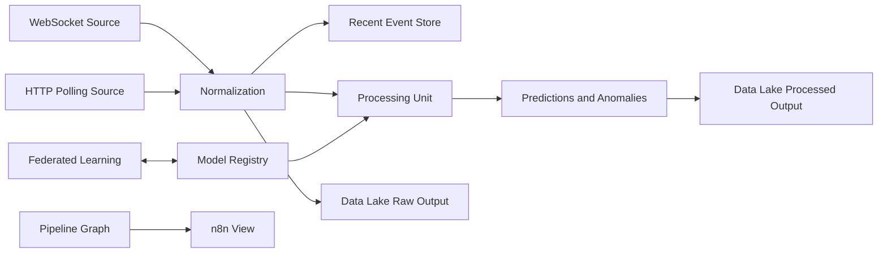

# Real-Time Smart City Pipeline Plan

## Purpose

Turn the current mock real-time connectors page into a real, organization-scoped pipeline system for smart city data.

The final product should let a user create multiple pipelines where each pipeline can:

- receive simulated or real sensor data through WebSocket streaming,
- receive simulated or real sensor data through HTTP polling,
- route raw and processed outputs into a configurable S3-compatible data lake,
- train and select smart-city time-series models,
- run selected models inside the processing unit,
- connect to federated or real-time learning flows,
- open an n8n-style workflow view of the same pipeline.

All implementation should use Bun for installs, scripts, builds, tests, and local tooling.

## Current State

The current page is mostly mocked in `frontend/src/pages/connectors-page.vue`.

It already presents the right product concepts:

- data sources,
- stream engine,
- S3 data lake,
- federated learning,
- canvas/workflow view,
- logs and simulated live status.

The plan is to keep this UX direction, but replace local mock state with real backend APIs, persisted database entities, runtime services, and organization-filtered data.

## Core Requirements

1. Pipelines are organization-scoped.
2. A user can create several pipelines per organization.
3. Organization switching must filter pipelines, uploads, model runs, data lake connections, and streaming sources.
4. Each pipeline can contain multiple data sources.
5. Sources can be either WebSocket streaming or HTTP polling.
6. Simulators should exist so demos work without external IoT infrastructure.
7. Model training should use `data/astana_synthetic_data.csv` first, then optional open-source smart-city datasets.
8. Training saves local artifacts in a dedicated folder.
9. Promoted model artifacts can be copied to S3-compatible storage for fast serving.
10. The processing unit can select which model to use.
11. Data lake connections support CRUD, test connection, disconnect, and configurable output paths.
12. Federated learning and real-time learning controls become real connection/configuration surfaces.
13. Clicking federated/model learning controls should open the Models tab or route.
14. Every pipeline should have an n8n view option.
15. The n8n view should represent the same pipeline graph, not a separate mock.

## Proposed Domain Model

### `SmartCityPipeline`

Represents one reusable pipeline inside an organization.

Suggested fields:

- `id`
- `organizationId`
- `createdByUserId`
- `name`
- `description`
- `status`: `DRAFT`, `ACTIVE`, `PAUSED`, `ERROR`, `ARCHIVED`
- `graphJson`: canonical nodes and edges for canvas/n8n view
- `activeModelId`
- `dataLakeConnectionId`
- `createdAt`
- `updatedAt`

### `SensorSource`

Represents one stream or polling input.

Suggested fields:

- `id`
- `organizationId`
- `pipelineId`
- `name`
- `type`: `WEBSOCKET`, `HTTP_POLLING`
- `mode`: `SIMULATED`, `EXTERNAL`
- `status`: `STOPPED`, `RUNNING`, `ERROR`
- `schemaJson`
- `connectionConfigEncrypted`
- `pollIntervalMs`
- `lastSeenAt`
- `lastError`
- `createdAt`
- `updatedAt`

### `SensorEvent`

Stores recent or sampled incoming events. Full high-volume storage should go to the data lake.

Suggested fields:

- `id`
- `organizationId`
- `pipelineId`
- `sourceId`
- `eventTime`
- `sensorType`
- `location`
- `payloadJson`
- `createdAt`

Use retention limits for database storage. Long-term raw data belongs in S3.

### `DataLakeConnection`

Represents S3-compatible output storage.

Suggested fields:

- `id`
- `organizationId`
- `name`
- `provider`: `AWS_S3`, `MINIO`, `R2`, `CUSTOM_S3`
- `bucket`
- `region`
- `endpoint`
- `basePrefix`
- `accessKeyEncrypted`
- `secretKeyEncrypted`
- `isDefault`
- `lastTestedAt`
- `lastTestStatus`
- `createdAt`
- `updatedAt`

### `DataLakePathRule`

Defines configurable output bucketing.

Suggested fields:

- `id`
- `dataLakeConnectionId`
- `outputType`: `RAW`, `CLEANED`, `PREDICTIONS`, `ANOMALIES`, `MODEL_ARTIFACTS`, `AUDIT`
- `prefixTemplate`
- `format`: `JSONL`, `PARQUET`, `CSV`
- `partitioning`: `HOURLY`, `DAILY`, `MONTHLY`

Example prefix templates:

- `{organizationId}/{pipelineId}/raw/{yyyy}/{MM}/{dd}/{HH}/`
- `{organizationId}/{pipelineId}/predictions/{modelId}/{yyyy}/{MM}/{dd}/`
- `{organizationId}/models/{modelId}/{version}/`

### `ModelTrainingRun`

Tracks training jobs.

Suggested fields:

- `id`
- `organizationId`
- `pipelineId`
- `createdByUserId`
- `name`
- `datasetConfigJson`
- `featureSpecJson`
- `modelType`
- `status`: `QUEUED`, `RUNNING`, `SUCCEEDED`, `FAILED`, `CANCELED`
- `localArtifactPath`
- `metricsJson`
- `logsJson`
- `startedAt`
- `finishedAt`
- `createdAt`
- `updatedAt`

### `ModelArtifact`

Represents a trained model version.

Suggested fields:

- `id`
- `organizationId`
- `trainingRunId`
- `name`
- `modelType`
- `version`
- `status`: `LOCAL_ONLY`, `PROMOTED`, `DEPLOYED`, `ARCHIVED`
- `localPath`
- `s3Uri`
- `featureSpecJson`
- `metricsJson`
- `createdAt`
- `updatedAt`

### `FederatedLearningConnection`

Represents a federated or online learning endpoint.

Suggested fields:

- `id`
- `organizationId`
- `pipelineId`
- `name`
- `type`: `FEDERATED`, `ONLINE_LEARNING`
- `status`: `DISCONNECTED`, `CONNECTED`, `ERROR`
- `endpoint`
- `configEncrypted`
- `lastSyncAt`
- `lastError`
- `createdAt`
- `updatedAt`

## Backend Modules

### Pipelines Module

Responsibilities:

- CRUD pipelines.
- Store pipeline graph.
- Attach sources, data lake, model, and federated learning config.
- Enforce organization access.
- Provide dashboard summary for the frontend page.

Suggested endpoints:

- `GET /smart-city-pipelines`
- `POST /smart-city-pipelines`
- `GET /smart-city-pipelines/:id`
- `PATCH /smart-city-pipelines/:id`
- `DELETE /smart-city-pipelines/:id`
- `PATCH /smart-city-pipelines/:id/graph`
- `PATCH /smart-city-pipelines/:id/active-model`
- `PATCH /smart-city-pipelines/:id/data-lake`

### Sensor Runtime Module

Responsibilities:

- Create and maintain WebSocket sensor streams.
- Create and maintain HTTP polling sources.
- Provide simulated data sources for demos.
- Normalize incoming events.
- Write recent events to database.
- Forward raw events to data lake when configured.
- Forward normalized events to processing unit.

Suggested endpoints:

- `GET /sensor-sources?pipelineId=...`
- `POST /sensor-sources`
- `PATCH /sensor-sources/:id`
- `DELETE /sensor-sources/:id`
- `POST /sensor-sources/:id/start`
- `POST /sensor-sources/:id/stop`
- `POST /sensor-sources/:id/test`
- `GET /sensor-events?pipelineId=...`
- `GET /sensor-streams/:pipelineId/ws`

Simulator source types:

- traffic flow,
- public transport telemetry,
- air quality,
- weather,
- energy consumption,
- noise level,
- water usage,
- parking occupancy,
- emergency events.

### Data Lake Module

Responsibilities:

- CRUD S3-compatible connections.
- Encrypt credentials.
- Test bucket access.
- Manage output path rules.
- Disconnect a connection without deleting historical records.
- Upload raw, processed, and model artifact outputs.

Suggested endpoints:

- `GET /data-lakes`
- `POST /data-lakes`
- `GET /data-lakes/:id`
- `PATCH /data-lakes/:id`
- `DELETE /data-lakes/:id`
- `POST /data-lakes/:id/test`
- `POST /data-lakes/:id/disconnect`
- `GET /data-lakes/:id/path-rules`
- `PUT /data-lakes/:id/path-rules`

Security:

- Store S3 secrets encrypted.
- Never return secret values to the frontend.
- Return only presence flags like `hasAccessKey` and `hasSecretKey`.
- Audit create, edit, test, disconnect, and delete actions.

### Model Training Module

Responsibilities:

- Prepare datasets.
- Train multiple model types.
- Track training jobs.
- Save local artifacts.
- Promote artifacts to S3 when requested.
- Register model versions for use in processing units.

Suggested endpoints:

- `GET /models`
- `GET /models/:id`
- `POST /models/train`
- `GET /model-training-runs`
- `GET /model-training-runs/:id`
- `POST /model-training-runs/:id/cancel`
- `POST /models/:id/promote`
- `POST /models/:id/deploy`

Local artifact layout:

```text
backend/model-artifacts/
  training/
    <organizationId>/
      <runId>/
        dataset-profile.json
        feature-spec.json
        metrics.json
        model.bin
        logs.jsonl
  registry/
    <organizationId>/
      <modelId>/
        <version>/
          model.bin
          feature-spec.json
          metrics.json
```

S3 artifact layout:

```text
{basePrefix}/models/{organizationId}/{modelId}/{version}/model.bin
{basePrefix}/models/{organizationId}/{modelId}/{version}/feature-spec.json
{basePrefix}/models/{organizationId}/{modelId}/{version}/metrics.json
```

### Processing Unit Module

Responsibilities:

- Load selected model for each pipeline.
- Run inference over streaming and polling events.
- Emit predictions, anomaly scores, and enriched events.
- Persist recent inference results.
- Write configured outputs to data lake.

Suggested endpoints:

- `GET /processing-units?pipelineId=...`
- `PATCH /processing-units/:pipelineId/model`
- `POST /processing-units/:pipelineId/test-inference`
- `GET /processing-units/:pipelineId/metrics`

### Federated Learning Module

Responsibilities:

- Configure federated or online learning connections.
- Connect/disconnect endpoints.
- Track sync and learning status.
- Send model updates or receive remote model updates.
- Link UI actions to the Models tab.

Suggested endpoints:

- `GET /federated-connections?pipelineId=...`
- `POST /federated-connections`
- `PATCH /federated-connections/:id`
- `DELETE /federated-connections/:id`
- `POST /federated-connections/:id/connect`
- `POST /federated-connections/:id/disconnect`
- `POST /federated-connections/:id/sync`

### n8n View Module

Responsibilities:

- Convert internal pipeline graph to n8n-compatible workflow JSON.
- Render a read-only n8n-style workflow view in the app.
- Later support export/import of n8n workflow JSON.

Suggested endpoints:

- `GET /pipelines/:id/n8n-workflow`
- `POST /pipelines/:id/n8n-workflow/export`
- `POST /pipelines/:id/n8n-workflow/import`

First implementation should make this read-only and generated from the canonical pipeline graph.

## Model Training Strategy

### Dataset Inputs

Primary local dataset:

- `data/astana_synthetic_data.csv`

Additional open-source dataset support should be pluggable. The first pass should support importing datasets by local file or URL into a normalized dataset registry.

Recommended dataset categories:

- traffic volume and congestion,
- public transport telemetry,
- weather observations,
- air quality,
- energy demand,
- water usage,
- parking occupancy,
- incident and emergency events.

### Flexible Time-Series Preparation

To support different smart city datasets, training should not assume one fixed CSV schema.

The preparation step should infer or let the user map:

- timestamp column,
- entity or sensor id column,
- location columns,
- target column,
- numeric feature columns,
- categorical feature columns,
- event type columns.

Preparation should include:

- timestamp parsing,
- timezone normalization,
- deduplication,
- missing value handling,
- resampling,
- rolling features,
- lag features,
- calendar features,
- location-aware grouping,
- train/validation split by time.

Output:

- `dataset-profile.json`
- `feature-spec.json`
- prepared training matrix
- validation matrix

### Model Types

Start with a practical model ladder.

Phase one:

- baseline moving average,
- z-score anomaly detector,
- isolation forest,
- random forest regressor/classifier.

Phase two:

- gradient boosted trees,
- LSTM or GRU for sequence forecasting,
- temporal convolution model,
- autoencoder anomaly detection.

Phase three:

- online learning model,
- federated update-compatible model.

The UI should describe model capability by task:

- forecasting,
- anomaly detection,
- classification,
- clustering,
- incident detection.

### Training Runtime

Recommended approach:

- NestJS owns job creation, persistence, permissions, and artifact registry.
- A worker process performs heavier ML work.
- Use Bun to orchestrate scripts.
- Python may be used for ML internals if the selected libraries require it, but all project commands should still be invoked through Bun scripts.

Example Bun scripts to add later:

```json
{
  "scripts": {
    "models:prepare": "bun run scripts/models/prepare.ts",
    "models:train": "bun run scripts/models/train.ts",
    "models:evaluate": "bun run scripts/models/evaluate.ts"
  }
}
```

## Frontend Plan

### Replace Mock State

Update `frontend/src/pages/connectors-page.vue` to load:

- current organization,
- pipelines for the organization,
- selected pipeline,
- sensor sources,
- latest events,
- data lake connection,
- model registry summary,
- active model,
- federated learning connection,
- pipeline graph.

### Pipeline UX

Required actions:

- create pipeline,
- rename pipeline,
- duplicate pipeline,
- archive or delete pipeline,
- switch selected pipeline,
- start/pause pipeline runtime,
- open n8n view,
- open Models tab.

### Sensor UX

Required actions:

- add WebSocket simulator,
- add HTTP polling simulator,
- add external WebSocket source,
- add external HTTP polling source,
- start source,
- stop source,
- test source,
- delete source,
- inspect latest payloads.

### Data Lake UX

Required actions:

- create S3 connection,
- edit S3 connection,
- test connection,
- disconnect,
- delete,
- configure path rules,
- choose default data lake for pipeline.

### Model UX

Required actions:

- open model training form,
- select dataset,
- map columns,
- choose model type,
- start training,
- view training status,
- view metrics,
- promote model to S3,
- select model for processing unit.

### Federated Learning UX

Required actions:

- create connection,
- connect/disconnect,
- sync,
- view last sync state,
- open Models tab on click.

## Pipeline Runtime Flow



## Implementation Phases

### Phase 1: Persist Real Pipelines

Deliverables:

- Prisma models and migration for pipelines.
- Backend CRUD endpoints.
- Frontend pipeline list and selected pipeline state.
- Organization filtering.
- Empty state replacing mock-only flow.

Acceptance criteria:

- creating a pipeline persists in the database,
- switching organization changes visible pipelines,
- refreshing the page keeps pipelines.

### Phase 2: Real Sensor Sources and Simulators

Deliverables:

- Prisma models and migration for sensor sources/events.
- WebSocket simulator service.
- HTTP polling simulator service.
- source start/stop/test endpoints.
- frontend source CRUD.
- live event panel connected to backend.

Acceptance criteria:

- a WebSocket source emits changing sensor events,
- an HTTP polling source produces new events on interval,
- events are organization and pipeline scoped,
- source state survives page refresh.

### Phase 3: Data Lake CRUD

Deliverables:

- Prisma models and migration for data lake connections/path rules.
- encrypted credential storage.
- S3-compatible test connection.
- output prefix templates.
- frontend CRUD forms.
- pipeline-level data lake selection.

Acceptance criteria:

- user can create, edit, test, disconnect, and delete a data lake,
- secrets are not returned to the frontend,
- a pipeline can write raw sample output to configured path.

### Phase 4: Dataset Preparation and Model Training

Deliverables:

- dataset registry or import flow.
- support for `data/astana_synthetic_data.csv`.
- schema inference and mapping.
- training run persistence.
- local artifact folder creation.
- baseline model training.
- metrics view.

Acceptance criteria:

- user can start training from Astana dataset,
- artifacts are saved locally under `backend/model-artifacts/`,
- model metrics are visible in the UI,
- failed runs preserve logs.

### Phase 5: Model Registry and Processing Unit

Deliverables:

- model artifact registry.
- promote-to-S3 action.
- active model selection per pipeline.
- streaming inference.
- prediction/anomaly event output.

Acceptance criteria:

- user can choose a trained model for a pipeline,
- incoming sensor events are processed by that model,
- predictions are visible in the UI,
- outputs can be written to the data lake.

### Phase 6: Federated and Real-Time Learning

Deliverables:

- federated connection CRUD.
- connect/disconnect/sync actions.
- online learning config.
- Models tab deep link.
- status and last sync display.

Acceptance criteria:

- clicking the federated learning area opens the Models tab,
- connection config persists,
- sync actions produce audit/status records.

### Phase 7: n8n View

Deliverables:

- generated n8n-compatible workflow JSON.
- n8n-style read-only visual view.
- workflow export.
- graph stays in sync with pipeline configuration.

Acceptance criteria:

- every pipeline has an n8n view,
- the view reflects sources, processing unit, model, data lake, and federated nodes,
- exported workflow JSON is generated from real pipeline state.

### Phase 8: Hardening

Deliverables:

- permissions tests,
- organization isolation tests,
- data lake credential tests,
- runtime restart behavior,
- source backoff/retry,
- model artifact cleanup job,
- audit logs.

Acceptance criteria:

- one organization cannot access another organization's pipelines,
- stopped sources stop producing events,
- deleted pipelines cleanly detach runtime jobs,
- missing model credentials or data lake secrets fail with clear messages.

## Testing Plan

Backend:

- unit tests for services,
- permission tests for organization-scoped endpoints,
- integration tests for pipeline CRUD,
- integration tests for source start/stop/test,
- data lake credential encryption tests,
- model training job state tests.

Frontend:

- type checks,
- component tests for forms and state transitions,
- e2e test for creating a pipeline,
- e2e test for adding a simulator source,
- e2e test for selecting a model,
- e2e test for opening n8n view.

Manual smoke flow:

1. Register or login.
2. Select an organization.
3. Create a pipeline.
4. Add WebSocket simulator.
5. Add HTTP polling simulator.
6. Start both.
7. Confirm live events appear.
8. Create S3 data lake connection.
9. Test connection.
10. Train model on `data/astana_synthetic_data.csv`.
11. Select trained model for processing unit.
12. Confirm predictions appear.
13. Open n8n view.
14. Switch organization and confirm data is filtered.

## Open Decisions

1. Whether ML runtime should be TypeScript-only, Python-backed, or hybrid.
2. Which S3-compatible provider should be the first-class default.
3. Whether event buffering should use the database, Redis, PgBoss, or a dedicated stream broker.
4. How much historical event data should remain in Postgres before being moved only to S3.
5. Which open-source smart city datasets should be bundled, downloaded, or user-imported.
6. Whether n8n integration should be visual-only first or support direct execution in an n8n instance.

## Recommended First Slice

Build the smallest real vertical path:

1. `SmartCityPipeline` CRUD.
2. `SensorSource` CRUD.
3. WebSocket simulator.
4. HTTP polling simulator.
5. Recent event API.
6. Frontend page bound to real APIs.
7. Organization filtering.
8. Read-only n8n view generated from pipeline state.

This makes the mock page real quickly while leaving model training, data lake, and federated learning to attach cleanly as the next slices.
