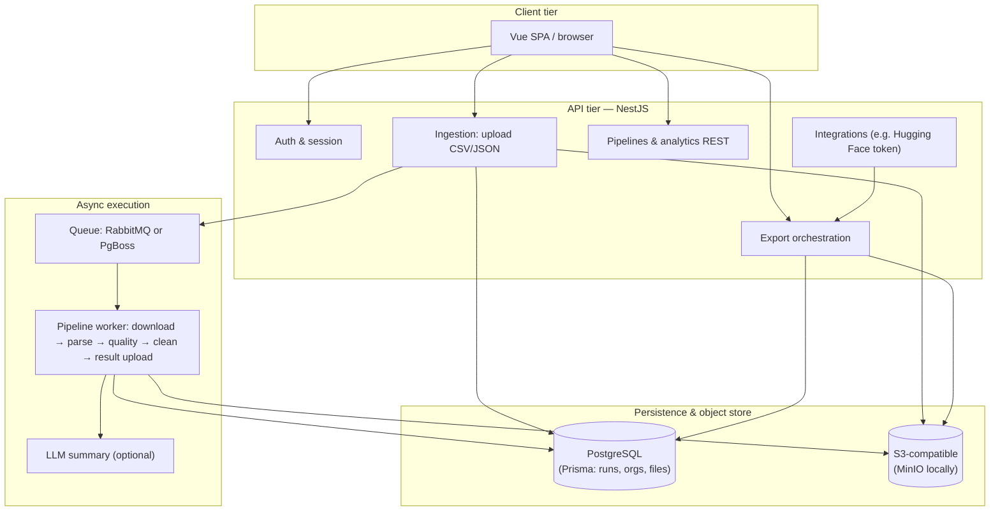
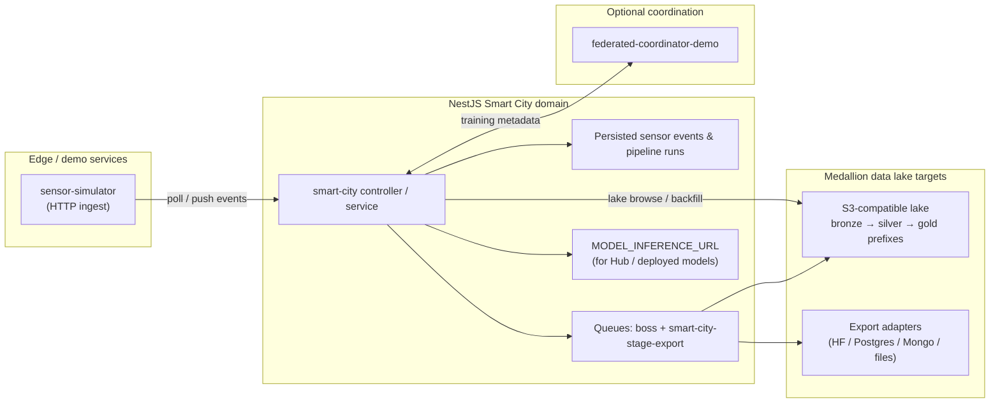
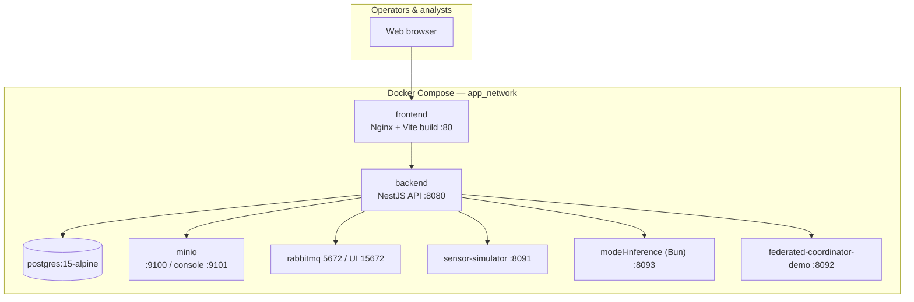

# Flowmatic — Thesis Supplement V2 (Q1-Level Extensions & Platform Evolution)

**Document type:** Post-thesis technical supplement for master’s examination (Q1-aligned rigor), repository audit, and journal-oriented positioning.  
**Baseline manuscript:** *Development of an Intelligent Assistant for Data Preparation Automation in Urban Transportation Management Systems* (Astana IT University, June 2025; condensed PDF v5).  
**Repository scope:** Flowmatic monorepo — NestJS backend, Vue frontend, Smart City module, neural research artifacts (`models/`), and containerized edge services.

---

## 1. Executive summary

The original thesis advances a **unified intelligent assistant** for urban traffic data: multi-dimensional **data quality indexing**, **automated feature engineering**, **ensemble anomaly detection** (Isolation Forest, Local Outlier Factor, One-Class SVM), and **tabular event classification** where **XGBoost** is the principal comparator alongside Random Forest, SVM, logistic regression, and shallow neural baselines. Architectural sketches (Figures 4.1–4.2) describe a **Python-centric** batch path and a **Kafka-centric** streaming decomposition.

The Flowmatic platform **preserves the scientific intent**—automation from messy ingestion through quality-aware preparation to analytic handoff—but **realizes it as production software**:

- A **tabular batch pipeline** exposes upload, asynchronous cleaning, persistence, analytics, LLM-guided narration, and **multi-destination export**, implemented in TypeScript (`backend/`) rather than standalone notebooks alone.
- A **Smart City workbench** operationalizes streaming-like behavior through **sensor simulators**, **organization-scoped pipelines**, **Boss/PgBoss and Rabbit-backed queues**, and **S3-compatible medallion sinks**, replacing the manuscript’s illustrative Kafka taxonomy with interoperable middleware that matches institutional DevOps norms.
- A **parallel Q1 neural suite** benchmarks **forecasting**, **imputation**, **anomaly reconstruction**, **graph traffic models**, **linear horizons**, and a **Transformer severity classifier**, with TorchScript-compatible checkpoints, latency probes, and a **checkpoint leaderboard**. This materially extends Chapter 5 beyond classical ensembles without invalidating their role as pedagogical anchors.

Readers should interpret this supplement as a **continuation chapter**: it aligns narrative claims with runnable services, inventories **coverage gaps** (see also `GAP_ANALYSIS.md`), and positions the combined empirical record for **Q1 venues** that reward both methodological rigor and reproducible systems.

---

## 2. Gap analysis (manuscript PDF versus implementation)

A structured comparison appears in `thesis/GAP_ANALYSIS.md`. In brief:

- The thesis **abstract** highlights **Random Forest** at **96.62%** accuracy, while the body positions **XGBoost** as the strongest balanced classifier in the comparative table—a minor **internal discrepancy** reviewers may note when harmonizing abstracts.
- **Kafka-specific** topic naming in §4.5 is **not mirrored one-to-one** in `docker-compose.yml`; asynchronous work instead flows through **RabbitMQ**, **PgBoss-friendly patterns**, and **HTTP/streaming adjuncts**.
- Classical **ensemble anomaly detectors** from the dissertation are **not exported as Nest services** matching IF/LOF/OCSVM; related capability appears in neural **TranAD** checkpoints (see leaderboard) plus rule/statistical QC on uploads.
- The thesis **datasets** emphasize Astana semi-synthetics plus **METR-LA / PeMS families** for comparative quality scores; neural artifacts additionally publish **HF-weather**, **HF-ETT**, and **HF-traffic** results for leaderboard diversity.

---

## 3. Updated architecture (replacements for Figures 4.1–4.2 and deployment context)

Publication-ready vector assets can be generated from **`thesis/figures/architecture/*.mmd`** using the Mermaid CLI (`@mermaid-js/mermaid-cli`, command `mmdc`). The following diagrams are **semantically equivalent** to the shipped `.mmd` sources and may be pasted into LaTeX via **SVG or high-DPI PNG** exports.

### 3.1 Batch upload pipeline (successor to Figure 4.1)

This path corresponds to the **Intelligent Data Preparation Platform** described in `backend/docs/PROJECT_GUIDE.md`: authenticated upload, durable object storage, queued workers, and export adapters.



**Canonical source:** `thesis/figures/architecture/01-batch-upload-pipeline.mmd`.

### 3.2 Smart City “streaming” pipeline (conceptual successor to Figure 4.2)

Rather than prescribing four topic names verbatim, Flowmatic binds **telemetry ingress**, **stateful pipelines**, optional **model-inference egress**, asynchronous **lake export**, and a **demo federated coordinator** into one deployable story.



**Canonical source:** `thesis/figures/architecture/02-smart-city-streaming.mmd`.

### 3.3 Microservices topology (`docker-compose.yml`)



**Canonical source:** `thesis/figures/architecture/03-microservices-topology.mmd`.

### 3.4 Medallion data lake

The UI Workbench (`pipeline-lake-export-stage.vue`) documents **medallion tiers** for lake exports. A diagram suitable for Chapter 4 or an appendix lives at **`thesis/figures/architecture/04-medallion-data-lake.mmd`**.

---

## 4. Neural model evaluation (Q1 suite & leaderboard)

### 4.1 Artifact trail

| Artifact | Role |
| --- | --- |
| `models/paper/reports/Q1_EXPERIMENT_REPORT.md` | Narrative summary, best runs, figure inventory |
| `models/paper/tables/checkpoint_leaderboard.md` | Full tabular inventory (metrics, parameters, latency, TorchScript flags) |
| `models/reports/q1_core_suite_metrics.json` | Eight canonical runs with train/val/test splits (timestamp `2026-04-09`) |
| `models/reports/production_model_registry.json` | Registry of **47** checkpoints with file integrity metadata (`sha256`) under `checkpointRoot` |

### 4.2 Representative results (summarized from leaderboard)

Tables below excerpt **canonical Q1-named** rows where multi-seed variants exist (values from `checkpoint_leaderboard.md`; scientific writing should cite exact checkpoint names).

**Table S1 — Multivariate forecasting & reconstruction (selection, test RMSE / MAE)**

| Model kind | Checkpoint (representative) | Dataset | Test RMSE | Test MAE |
| --- | --- | --- | --- | --- |
| `timesblock_forecast` | `q1_hf_weather_timesblock_forecaster_seed2026` | hf_weather | 0.0332 | 0.0254 |
| `dlinear_forecast` | `q1_hf_ett_dlinear_energy_forecaster_seed2026` | hf_ett | 0.1450 | 0.1079 |
| `patchtst_forecast` | `q1_astana_patchtst_density_forecaster_seed7` | astana | 0.5585 | 0.3307 |
| `itransformer_forecast` | `q1_astana_itransformer_speed_forecaster_seed42` | astana | 0.9980 | 0.8659 |
| `stgcn_forecast` | `q1_hf_traffic_stgcn_forecaster_seed2026` | hf_traffic | 0.4803 | 0.2702 |

**Table S2 — Anomaly-oriented reconstruction (TranAD)**

| Checkpoint | Dataset | Test RMSE | Test MAE | Latency (ms) |
| --- | --- | --- | --- | --- |
| `q1_astana_tranad_anomaly_detector_seed42` | astana | 0.0308 | 0.0226 | 1.4158 |

**Table S3 — Classification (Transformer severity)**

| Checkpoint | Test accuracy | Test macro-F1 | Latency (ms) |
| --- | --- | --- | --- |
| `q1_astana_transformer_severity_classifier_seed7` | 0.9909 | 0.9252 | 0.6774 |

**Table S4 — Imputation (SAITS, masked MSE)**

| Checkpoint | test_masked_mse | Latency (ms) |
| --- | --- | --- |
| `q1_astana_saits_imputer_seed2026` | 0.6307 | 0.7188 |

### 4.3 Core suite JSON cross-check

`q1_core_suite_metrics.json` fixes an **epoch-8** training snapshot for eight families; numbers differ slightly from leaderboard seed-specific optima because the JSON captures a **single aggregate training pass** per architecture. For publication, **prefer leaderboard rows** when reporting best observed test metrics, and use the JSON for **wall-clock and training-curve provenance**.

### 4.4 Epistemic caveat (from project report)

The Q1 report (`Q1_EXPERIMENT_REPORT.md`) reminds authors to reconcile these artifacts with **official upstream implementations** and **license-compatible splits** when submitting to archival venues. Flowmatic’s value proposition is **traceable engineering integration**, not a claim of having independently reproduced every baseline paper under identical conditions.

---

## 5. Production deployment (Docker, Hugging Face, model-inference)

### 5.1 Compose-aligned runtime

The authoritative stack graph is **`docker-compose.yml`** at repository root:

- **Data plane:** PostgreSQL 15, MinIO, RabbitMQ 3.13 (management UI exposed for diagnostics).
- **Control plane:** `backend` (NestJS) depends on healthy **sensor-simulator** and **model-inference**, matching production assumptions that telemetry and inference are reachable from the API container.
- **Presentation:** `frontend` image serves the compiled Vue bundle behind Nginx on port **80**.
- **Environment contracts:** `SENSOR_SIMULATOR_URL`, `MODEL_INFERENCE_URL`, `FEDERATED_COORDINATOR_DEMO_URL`, and S3/Rabbit credentials wire cross-container calls without hard-coded hostnames in application code.

### 5.2 Hugging Face integration

The backend exposes **organization-scoped** Hugging Face token lifecycle via `HuggingFaceIntegrationService`: token validation through `whoAmI`, model listing by author, and coupling with `ExportService` for secure storage. This enables **dataset and model publication** consistent with the thesis theme of bridging preparation and downstream ML ecosystems.

### 5.3 Model-inference microservice

`services/model-inference/` implements a **Bun** service (`README.md`) with `GET /health` and `POST /v1/infer`, forwarding structured sensor-style JSON to the **Hugging Face Inference API** using tokens supplied by the backend. `MODEL_INFERENCE_URL` defaults to `http://model-inference:8093` under Compose, isolating third-party API concerns from core Nest processes.

---

## 6. Integrating UI and architecture screenshots

Create or collect PNG/SVG exports under **`thesis/figures/screenshots/`** (directory may be created alongside this supplement). Suggested naming for Memoir/LaTeX cross-references:

| Filename stub | Suggested content |
| --- | --- |
| `workbench-pipeline-sources.png` | Smart City workbench — **Sources** stage with live simulator status |
| `workbench-pipeline-lake.png` | **Data Lake & Export** stage showing medallion browser |
| `docker-ps-flowmatic.png` | `docker compose ps` or Portainer view listing healthy services |
| `swagger-backend.png` | Swagger UI at `/api` showing Smart City + ingestion routes |
| `hf-settings-token.png` | Settings / Connectors page with HF integration (redact token) |

**LaTeX (memoir) pattern**

```latex
\begin{figure}[t]
  \centering
  \includegraphics[width=\linewidth]{figures/screenshots/workbench-pipeline-lake.png}
  \caption{Smart City medallion-aware lake stage in the Flowmatic Vue workbench.}
  \label{fig:supp-lake-ui}
\end{figure}
```

Ensure **≥300 DPI** raster exports for print. Redact secrets in any credential screenshot.

Detailed naming conventions are listed in `thesis/figures/screenshots/README.md`.

---

## 7. Q1 publication positioning

**Problem framing.** Urban ITS still spends disproportionate labor on cleansing heterogeneous telemetry; the thesis framed this gap theoretically. Flowmatic contributes a **dual evidence line**: classical tabular baselines remain conceptually intact, while **scalable neural monitoring** demonstrates that the **same institutional workflows**—ingest → QC → featurization/export—can orchestrate deep models when stakeholders demand fidelity on non-stationary series and graph-structured correlations.

**Novelty axes suitable for premium venues**

1. **Systems + reproducibility:** Deterministic leaderboard tables, cryptographic file hashes in `production_model_registry.json`, and containerized parity between development and demos.
2. **Operational ML:** Separation of inference into `model-inference`, Hugging Face token governance, medallion-aligned lake exports, federated demos for governance-sensitive traffic authorities.
3. **Cross-modal evaluation:** Joint presentation of **energy (ETT)**, **meteorology (weather)**, **graph traffic (STGCN)**, and **Astana-native** tracks shows generalization beyond a single municipal generator.

**Honest limitations for reviewers**

- Neural suite metrics are **project-scoped checkpoints**; claims must differentiate **research artifacts** integrated into Flowmatic from **novel architectural contributions** in each neural paper cited.
- The thesis Kafka diagram is pedagogical; reviewers should cite the **Compose-backed** diagrams in §3 instead of literal topic names unless Kafka is adopted in deployment.

---

## 8. References (internal paths)

| Path | Purpose |
| --- | --- |
| `thesis/GAP_ANALYSIS.md` | Manuscript-vs-code bullet matrix |
| `thesis/figures/architecture/*.mmd` | Mermaid sources for PNG/SVG renders |
| `backend/docs/PROJECT_GUIDE.md` | Tabular pipeline & schema reference |
| `docker-compose.yml` | Topology & ports |
| `models/paper/reports/Q1_EXPERIMENT_REPORT.md` | Q1 narrative |

---

**End of supplement.**
